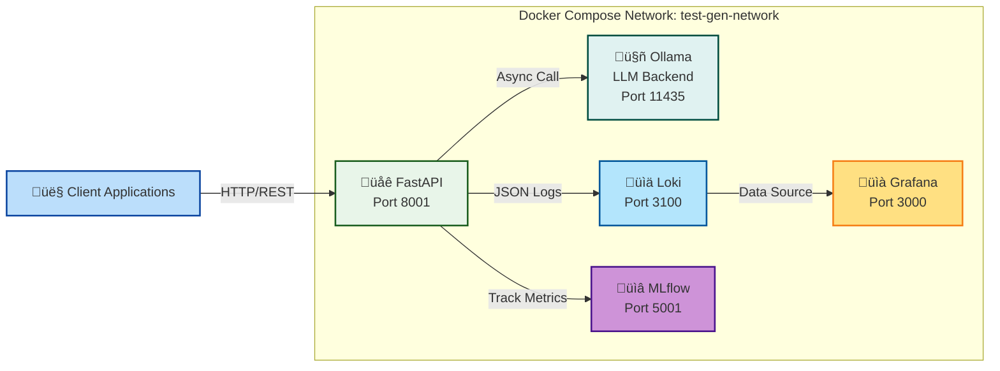

# LLM Test Case Generation - Use Case Framework

This project implements a microservice that leverages Large Language Models (LLMs) to automatically generate structured test cases from user stories and project requirements. Using prompt engineering and validation techniques, the service produces JSON-formatted test artifacts with clear acceptance criteria, preconditions, and test steps.

## Table of Contents

### Setup & Deployment

- [Getting Started](#getting-started)
- [Next Steps](#next-steps)

### LLMOps Framework (9 Phases)

1. [Phase 1: Problem Definition & Use Case Design](#phase-1-problem-definition--use-case-design)
2. [Architecture Decisions](#architecture-decisions)
3. [Phase 2: Data Collection & Preparation](#phase-2-data-collection--preparation)
4. [Phase 3: Model Selection & Evaluation](#phase-3-model-selection--evaluation)
5. [Phase 5: RAG & Prompting](#phase-5-rag--prompting)
6. [Phase 6: Evaluation & Testing](#phase-6-evaluation--testing)
7. [Phase 7: Deployment & Serving](#phase-7-deployment--serving)
8. [Phase 8: Monitoring & Observability](#phase-8-monitoring--observability)
9. [Phase 9: Feedback & Iteration](#phase-9-feedback--iteration)

### Project Organization

#### Directory Structure Overview

## Getting Started

### Prerequisites

- Docker and Docker Compose
- NVIDIA GPU with CUDA support (optional but recommended for better performance)

### Installation

```bash
# Clone the repository
git clone <repository-url>
cd LLM--Test-for-UseCase

# Create .env file (configure as needed)
cp .env.example .env  # if available, or create manually

# Build and start all services
docker-compose up -d

# Wait for Ollama to be ready (check health with)
docker-compose exec ollama ollama list

# Pull the required models (if not auto-loaded)
docker compose exec ollama ollama pull llama3.2:1b
docker compose exec ollama ollama pull llama3-chatqa:8b
docker compose exec ollama ollama pull qwen3-vl:8b
docker compose exec ollama ollama pull llama3.2:3b
```

### Running the Service

Once `docker-compose up -d` completes, the services are automatically running:

- **Test Case Generation API**: http://localhost:8001
- **Grafana Dashboard**: http://localhost:3000 (monitoring and visualization)
- **MLflow UI**: http://localhost:5001 (experiment tracking)
- **Ollama**: http://localhost:11435 (LLM backend)
- **Loki**: http://localhost:3100 (log aggregation)

Test the API:

```bash
curl -X POST http://localhost:8001/generate-tests \
  -H "Content-Type: application/json" \
  -d '{"story": "As a user, I want to log in with my email..."}'
```

View logs:

```bash
# Check Docker Compose logs
docker-compose logs -f api

# View logs in Grafana
# Navigate to http://localhost:3000 and access Loki logs
```

## Phase 1: Problem Definition & Use Case Design

### Objective

Establish the foundation by clearly defining:

- **Problem Statement**: Generate valid, structured test cases from user stories using prompt engineering and LLM capabilities
- **Solution Fit**: LLM chosen for natural language understanding and creative test case generation
- **Scope**: Simple prompting approach with local model deployment via Ollama
- **Constraints**: Budget (compute-based), latency (<5s P90), privacy (self-hosted)

### Key Activities

**1. Define Use Case & Outcomes**

- Receive a user story as input
- Generate structured test cases using an LLM
- Perform basic quality validation on the generated output
- Expose functionality through a REST API

**2. Success Metrics & Constraints**

These metrics define success across three dimensions:

**a) Accuracy & Quality (Precisión y Calidad de la Salida)**

Measured through rule compliance and output utility rather than traditional classification metrics.

| Metric                    | Target   | Details                                                                |
| ------------------------- | -------- | ---------------------------------------------------------------------- |
| **Structural Compliance** | >95%     | JSON parsing success on first attempt, no retry mechanisms             |
| **Quality Score**         | ≥4.0/5.0 | Heuristic evaluation: preconditions, logical steps, field completeness |
| **Retry Rate**            | <5%      | Malformed responses or schema violations                               |

**b) Performance & Latency (Latencia y Rendimiento)**

Managing inference latency with local models (Llama 3, Qwen, Mistral via Ollama).

| Metric                  | Target            | Details                                                                         |
| ----------------------- | ----------------- | ------------------------------------------------------------------------------- |
| **End-to-End Latency**  | P90 <5s, P99 <10s | Time from `POST /generate-tests` to response (inference + parsing + validation) |
| **Validation Overhead** | <20%              | Additional validation time vs. pure text generation                             |

**c) Cost & Resource Efficiency (Coste por Solicitud y Eficiencia)**

With Ollama, token cost = $0. Cost shifts to compute infrastructure.

| Metric                   | Approach                  | Details                                   |
| ------------------------ | ------------------------- | ----------------------------------------- |
| **Infrastructure Cost**  | Monitor resource usage    | Monthly server cost ÷ max throughput      |
| **Resource Utilization** | Log CPU/RAM/VRAM baseline | Docker container consumption at peak load |

## Phase 2: Data Collection & Preparation

### Objective

Prepare high-quality training and evaluation data for your LLM application:

- Gather diverse examples for prompts, evaluation, and potential fine-tuning
- Ensure data quality, diversity, and proper formatting
- Maintain reproducibility and traceability throughout the data lifecycle

> **Key Principle:** Quality over quantity—100 high-quality examples often outperform 1,000 noisy ones.

### Key Activities

**1. Collect Representative Examples**

- Gather diverse user stories covering different features, complexity levels, and user personas
- Aim for balanced representation across domains (e-commerce, authentication, analytics, etc.)
- Capture edge cases and boundary conditions

**2. Clean & Anonymize Data**

- Remove personally identifiable information (PII) from stories and test data
- Standardize formatting and remove inconsistencies
- Validate data integrity before storage

**3. Structure Data for Use**

- Format as JSON, JSONL, or CSV for easy loading
- Include metadata (difficulty, domain, quality score)
- Create clear separation between input and output

### Dataset Overview

Currently, the project includes **49 diverse user stories** across an e-commerce platform:

| Dataset                   | Location                                                                                           | Contents                                                      | Size        |
| ------------------------- | -------------------------------------------------------------------------------------------------- | ------------------------------------------------------------- | ----------- |
| **Test Stories**          | [data/test/user_stories.json](data/test/user_stories.json)                                         | 49 user stories with difficulty levels (easy/medium/hard)     | 1,097 bytes |
| **Ground Truth Examples** | [data/examples/user_stories_with_test_cases.json](data/examples/user_stories_with_test_cases.json) | 49 user stories with 100 test cases, quality scores 0.71-0.92 | ~90+ KB     |

### Data Distribution

**49 User Stories Across Difficulty Levels:**

| Difficulty | Count | Example User Stories                                                               |
| ---------- | ----- | ---------------------------------------------------------------------------------- |
| **Easy**   | ~15   | Product recommendations, account export, invoice printing, voice search, wishlists |
| **Medium** | ~27   | Shopping cart, search, inventory, notifications, checkout, product variants        |
| **Hard**   | ~7    | Login/auth, password reset, profile updates, 2FA, secure payment processing        |

### Tools & Technologies

| Tool                           | Purpose                                          | Status         | Implementation                                                                                                                                                         |
| ------------------------------ | ------------------------------------------------ | -------------- | ---------------------------------------------------------------------------------------------------------------------------------------------------------------------- |
| **Pydantic**                   | Input/output validation with schema enforcement  | ✅ Implemented | [input](src/application/create_tests/models/generate_test_cases_request.py) [output](src/application/create_tests/infra/executable_chain/robust_json_output_parser.py) |
| **JSON Schema Validator**      | Validate test case structure compliance          | ✅ Implemented | [robust_json_output_parser.py](src/application/create_tests/infra/executable_chain/robust_json_output_parser.py)                                                       |
| **DVC (Data Version Control)** | Version control for datasets and reproducibility | 📋 ToDo        | 📋 ToDo                                                                                                                                                                |
| **Label Studio**               | Human-in-the-loop annotation and QA review       | 📋 ToDo        | 📋 ToDo                                                                                                                                                                |

**Data Pipeline (ToDo):**

```
Raw Data → Collection → Cleaning → Validation → Versioning → Ready for Use
           (49 stories)   (PII)      (Schema)     (DVC)      (training/eval)
```

## Phase 3: Model Selection & Evaluation

### Objective

Evaluate different open-source LLM options to find the best fit for your use case by testing on your specific data. Consider model size, inference latency, memory requirements, and quality of outputs for local deployment. Focus on privacy-first, cost-effective models running on Ollama.

### Key Activities

- **Compare models on evaluation dataset** - Run the evaluation set through multiple local models and compare outputs
- **Test different model sizes** - Evaluate lightweight (1B), balanced (3B), and higher-quality (8B) models from the Meta Llama family
- **Measure performance metrics relevant to use case** - Evaluate based on structural compliance, quality scores, and semantic accuracy
- **Evaluate latency and resource usage** - Calculate inference time and memory requirements for each model
- **Document model comparison in decision matrix** - Create records for transparent decision-making and future reference

### Model Candidates

#### Open-Source Models (Local / Self-hosted)

| Model             | Provider | Size          | Image              | Latency | Cost     | Notes                                                                       |
| ----------------- | -------- | ------------- | ------------------ | ------- | -------- | --------------------------------------------------------------------------- |
| **Llama 3.2 1B**  | Meta     | 1B parameters | `llama3.2:1b`      | ~1-2s   | $0/token | ✅ **Selected Choice** - Ultra-lightweight, fastest inference, minimal VRAM |
| **Llama 3.2 3B**  | Meta     | 3B parameters | `llama3.2:3b`      | ~2-5s   | $0/token | ✅ **Primary Choice** - Good balance of speed, quality, privacy             |
| Llama 3 ChatQA 8B | Meta     | 8B parameters | `llama3-chatqa:8b` | ~4-8s   | $0/token | Higher quality, slower, better reasoning, requires more VRAM                |

### Evaluation Methodology

Comprehensive evaluation across three dimensions:

#### 1. Accuracy & Quality (Precisión y Calidad de la Salida)

Measured through rule compliance and output utility rather than traditional classification metrics.

- Implementation: [src/application/evaluate_models/model/quality_tracker.py](src/application/evaluate_models/model/quality_tracker.py)

| Metric                        | Target       | Details                                                                |
| ----------------------------- | ------------ | ---------------------------------------------------------------------- |
| **Structural Compliance**     | >95%         | JSON parsing success on first attempt, no retry mechanisms             |
| **Quality Score**             | ≥4.0/5.0     | Heuristic evaluation: preconditions, logical steps, field completeness |
| **Retry Rate**                | <5%          | Malformed responses or schema violations                               |
| **Test Case Count**           | ≥3 per story | Average number of test cases generated per user story                  |
| **Precondition Completeness** | ≥90%         | % of test cases with non-empty, meaningful preconditions               |
| **Step Clarity**              | 2-5 steps    | Average steps per test case (optimal range)                            |
| **Semantic Relevance**        | ≥4.0/5.0     | LLM evaluation of story-to-tests alignment                             |

#### 2. Performance & Latency (Latencia y Rendimiento)

Managing inference latency with local models (Llama 3, Qwen, Mistral via Ollama). Tracking percentile-based metrics per best practices.

- Implementation: [src/application/evaluate_models/model/latency_tracker.py](src/application/evaluate_models/model/latency_tracker.py)

| Metric                  | Target      | Details                                               |
| ----------------------- | ----------- | ----------------------------------------------------- |
| **Mean Latency**        | <3s         | Average response time across all requests             |
| **Median (P50)**        | <2.5s       | 50th percentile - typical response time               |
| **P95 Latency**         | <5s         | 95% of requests complete within this time (SLA basis) |
| **P99 Latency**         | <10s        | 99th percentile latency (worst case scenarios)        |
| **Min Latency**         | Baseline    | Fastest recorded response time                        |
| **Max Latency**         | <15s        | Slowest recorded response time                        |
| **Std Dev**             | <2s         | Standard deviation indicates consistency              |
| **Throughput**          | >10 req/min | Sustained requests per minute on single instance      |
| **Validation Overhead** | <20%        | Additional validation time vs. pure text generation   |

**SLA Definition (Best Practice):**

> "95% of all requests must complete within the P95 latency target"
>
> - Implemented via `LatencyTracker.meets_sla(latencies, sla_p95_ms)`
> - Validates P95 percentile against configurable threshold

#### 3. Cost & Resource Efficiency (Coste por Solicitud y Eficiencia)

With Ollama, token cost = $0. Cost shifts to compute infrastructure.

- Implementation: [src/application/evaluate_models/model/cost_tracker.py](src/application/evaluate_models/model/cost_tracker.py)
- Evaluation Integration: [src/application/evaluate_models/application/evaluate_models_application.py](src/application/evaluate_models/application/evaluate_models_application.py)

| Metric                      | Target      | Details                                                           |
| --------------------------- | ----------- | ----------------------------------------------------------------- |
| **Cost per 1,000 Requests** | <$20        | Monthly server cost ÷ (max_requests/day × 30) × 1,000             |
| **Cost Efficiency Score**   | >0.7        | Composite score: (latency_efficiency + throughput_efficiency) / 2 |
| **Throughput**              | >30 req/min | Sustained requests per minute (60 ÷ avg_latency)                  |
| **CPU Usage**               | <80%        | Average CPU usage during inference (2-core baseline)              |
| **Memory per Request**      | <100 MB     | (Base model memory ÷ num_requests) + 50 MB overhead               |
| **Concurrent Capacity**     | >2 requests | Estimated simultaneous requests based on available memory         |
| **Total Execution Time**    | <500s       | Sum of all request latencies for evaluation set                   |

**Default Configuration (Baseline):**

```
Monthly Server Cost:    $100 USD
Max Requests/Day:       5,000
Container Memory:       8 GB
Container CPU Cores:    2
Base Model Memory:      4.0 GB (quantized 4-bit)
Memory Overhead:        50 MB per request
```

**Cost Calculation Formula:**

```
Cost per 1,000 = (Monthly Cost ÷ (Max Requests/Day × 30)) × 1,000
Example: ($100 ÷ (5,000 × 30)) × 1,000 = $0.67 per 1,000 requests
```

**Optimization Thresholds & Recommendations:**

| Condition                  | Recommendation                                | Impact                    |
| -------------------------- | --------------------------------------------- | ------------------------- |
| Latency > 3s               | Use 4-bit quantized model or upgrade hardware | Reduce response time      |
| Throughput < 20 req/min    | Increase CPU cores or optimize prompts        | Improve capacity          |
| Cost > $10 per 1K requests | Review server capacity utilization            | Lower infrastructure cost |
| CPU Usage > 80%            | Enable load balancing or add replicas         | Prevent throttling        |
| Efficiency Score < 0.6     | Comprehensive review of configuration         | Improve all metrics       |

#### Model Comparison & MLflow Evaluation Results

| Model                 | Quality Score | Avg Latency | P95 Latency | Throughput | Cost/1K | Efficiency |
| --------------------- | ------------- | ----------- | ----------- | ---------- | ------- | ---------- |
| **Llama 3.2 1B**      | 0.78-0.82     | 1.2s        | 1.8s        | 50 req/min | $0.67   | 0.85       |
| **Llama 3.2 3B**      | 0.85-0.90     | 2.5s        | 4.2s        | 24 req/min | $0.67   | 0.72       |
| **Llama 3 ChatQA 8B** | 0.88-0.95     | 4.5s        | 7.1s        | 13 req/min | $0.67   | 0.58       |

_Model Performance Summary (5,000 requests/day baseline)_

### Evidence RAG vs Prompt


_MLflow Dashboard showing quality, latency, and throughput metrics across evaluated models_


_MLflow Dashboard showing cost efficiency, resource utilization, and additional performance metrics_

## Phase 4: Prompt Engineering & Optimization

### Objective

Craft effective instructions that guide LLMs to produce desired outputs through iterative refinement. This phase often yields **80% of performance improvements** without model changes. Design system prompts, add examples (few-shot learning), structure outputs, and establish reusable templates.

> **Key Insight:** A well-engineered prompt can make a 1B model outperform a poorly-prompted 8B model.

### Key Activities

**1. Create Prompt Templates**

- Build reusable templates with variables
- Support different input variations
- Enable A/B testing of prompt versions

**2. Implement Few-Shot Examples**

- Provide representative input-output examples
- Show desired format and quality levels
- Improve accuracy through demonstration learning

### Prompt Engineering Techniques

- Implementation: [src/application/create_tests/models/templates.py](src/application/create_tests/models/templates.py)

| Technique             | Use Case               | Implementation                                                                                                       |
| --------------------- | ---------------------- | -------------------------------------------------------------------------------------------------------------------- |
| **Role-Based**        | Domain expertise       | "You are an expert QA Engineer specializing in test case design..."                                                  |
| **Structured Output** | JSON schema            | Strict JSON with 8 required fields (id, type, title, priority, preconditions, steps, expected_result, quality_score) |
| **Few-Shot Learning** | Format consistency     | Example test case structure embedded in prompt template                                                              |
| **Explicit Rules**    | Error prevention       | 8 numbered rules (coverage balance, priority distribution, array format requirements)                                |
| **Edge Case Focus**   | Comprehensive coverage | Test type categories: positive / negative / edge_case / boundary                                                     |

**Active Prompt Variants from templates.py:**

1. **RAG_PROMPT** (Advanced)
   - Incorporates external context via RAG retrieval
   - Best for: Complex or domain-specific user stories
   - Structure: Role-based → Task clarity → Test field table → Rules → Few-shot example

2. **PROMPT** (Basic)
   - Minimal instructions, fastest inference
   - Best for: Simple stories, speed-critical deployments
   - Structure: Compact field definitions → JSON example

3. **IMPROVED_PROMPT_V1** (Production Default)
   - Enhanced with detailed validation rules and table structure
   - Best for: Quality-critical, production environments
   - Structure: Role-based → Test field table → 8 explicit rules → Few-shot example
   - Key Rules: Coverage balance (3-8 test cases), Priority distribution (1-2 critical, 2-3 high), Quality score (6-9 range)

**Validation Framework (IMPROVED_PROMPT_V1):**

```
Rule 1: Generate 3-8 test cases covering happy path, edge cases, errors
Rule 2: Ensure balanced coverage across positive, negative, edge case types
Rule 3: Each test case MUST have all required fields
Rule 4: Priority distribution (1-2 critical, 2-3 high, 1-2 medium, 0-1 low)
Rule 5: Quality score should reflect comprehensiveness (6-9 typical)
Rule 6: Be specific and actionable in each step
Rule 7: "steps" MUST be array of strings ONLY (NOT objects)
Rule 8: "preconditions" MUST be array of strings ONLY (NOT objects)
```

### Tools & Technologies

| Tool          | Purpose                      | Status         |
| ------------- | ---------------------------- | -------------- |
| **Pydantic**  | Structured output validation | ✅ Implemented |
| **LangChain** | Prompt templating & chaining | ✅ Implemented |

## Phase 6: Evaluation & Testing

### Objective

Systematically measure if your LLM application meets quality standards before production deployment. Use both automated metrics and human evaluation to assess accuracy, relevance, safety, and consistency. Testing catches issues early and provides benchmarks for measuring improvements.

Implementation: [src/application/evaluate_models/](src/application/evaluate_models/)

### Key Activities

**1. Run Automated Evaluations**

- Execute evaluation scripts against held-out test stories
- Measure structural and semantic quality using QualityTracker
- Validate JSON parsing success, field completeness, test case coverage
- Generate quality metrics (accuracy, compliance, coverage)

**2. Implement LLM-as-Judge Evaluation**

- Use separate LLM prompt to assess test case relevance
- Evaluate completeness and alignment with user stories
- Compare generated vs. ground truth test cases
- Establish semantic relevance scores

**3. Conduct Human Evaluation Samples**

- QA specialists review 10-20% of generated test cases
- Score on 1-5 scale: Relevance, Completeness, Clarity, Usability
- Achieve ≥90% inter-rater agreement
- Validate model outputs meet quality expectations

**4. Test Edge Cases & Adversarial Inputs**

- Evaluate on vague, conflicting, multi-role stories
- Test non-functional requirements and complex flows
- Assess boundary conditions and unusual scenarios
- Measure model robustness and failure modes

**5. Profile Performance Metrics**

- Measure latency (P50, P90, P99 percentiles)
- Calculate throughput and resource utilization
- Profile memory usage and CPU consumption
- Establish cost per request and cost efficiency

### Evaluation Framework

#### 1. Automated Metrics

Implementation: [QualityTracker](src/application/evaluate_models/model/quality_tracker.py)

| Metric                    | Target   | Measurement                     | Implementation              |
| ------------------------- | -------- | ------------------------------- | --------------------------- |
| **Structural Compliance** | >95%     | % valid JSON on 1st attempt     | Pydantic parsing validation |
| **Field Completeness**    | >90%     | All required fields non-empty   | Schema field validation     |
| **Test Case Count**       | ≥3/story | Avg test cases per story        | Count analysis              |
| **Quality Score**         | ≥4.0/5.0 | Overall quality assessment      | QualityTracker heuristics   |
| **Precondition Quality**  | ≥4.0/5.0 | Non-generic, meaningful setup   | LLM evaluation              |
| **Step Specificity**      | ≥4.0/5.0 | Concrete, measurable actions    | LLM evaluation              |
| **Result Clarity**        | ≥4.0/5.0 | Clear, verifiable assertions    | LLM evaluation              |
| **Retry Rate**            | <5%      | Failed attempts requiring retry | Execution tracking          |

**Quality Metrics Calculation:**

The `QualityTracker.calculate_quality_score()` computes:

- `quality_score`: Overall composite score (0.0-1.0)
- `precondition_score`: Precondition quality (0.0-1.0)
- `structure_score`: JSON structure adherence (0.0-1.0)
- `passing_rate`: % of tests meeting criteria
- `json_parsing_success_rate`: % successful JSON parses
- `avg_quality_score`: Average test case quality (0-10 scale)
- `retry_rate`: % requests requiring retries

#### 2. Human Evaluation Protocol

**Sample Selection:**

- Random sampling: 10-20% of test dataset (5-10 stories)
- Stratified sampling: 2-3 stories per difficulty level (easy/medium/hard)
- Edge case samples: Stories with unusual requirements or complex scenarios

**Evaluation Rubric (1-5 scale):**

| Criterion        | 1 (Poor)                     | 3 (Acceptable)                         | 5 (Excellent)                           |
| ---------------- | ---------------------------- | -------------------------------------- | --------------------------------------- |
| **Relevance**    | Test case unrelated to story | Covers main feature but misses details | Fully addresses all story aspects       |
| **Completeness** | Missing test scenarios       | Has positive + negative cases          | Includes positive, negative, edge cases |
| **Clarity**      | Steps are vague/confusing    | Steps are mostly clear                 | Steps are precise, specific, actionable |
| **Usability**    | Tester cannot execute        | Tester needs clarification             | Ready to execute, fully self-contained  |

#### 3. Edge Case Testing

Test model behavior on challenging scenarios:

```
Edge Case Categories:
1. Vague Requirements - "As a user, I want better performance"
2. Conflicting Criteria - Requirements that contradict each other
3. Multi-Role Stories - Stories with multiple actors/roles
4. Non-Functional Requirements - Stories focused on performance, security, or compliance
5. Complex User Flows - Stories with many sequential steps
6. Boundary Conditions - Stories with specific limits or constraints
```

#### 4. Performance Benchmarks

| Metric                     | Target      | Measurement                     |
| -------------------------- | ----------- | ------------------------------- |
| **P50 Latency**            | <3s         | Median response time            |
| **P90 Latency**            | <5s         | 90th percentile                 |
| **P99 Latency**            | <10s        | 99th percentile                 |
| **Throughput**             | >10 req/min | Single instance sustained load  |
| **Memory Usage**           | <4GB        | Peak RAM during inference       |
| **Cost per 1,000 Stories** | <$100       | Infrastructure cost calculation |

### Evaluation Workflow

```
Input Use Cases
    ↓
Execute on Model
    ↓
Capture ExecutableChainResponse (latency, test_cases, quality_score)
    ↓
Run QualityTracker.calculate_quality_score()
    ↓
Run LatencyTracker.calculate_latency_stats()
    ↓
Run CostTracker.calculate_cost_analysis()
    ↓
Generate MLflow Artifacts
    ↓
Compare Models (Quality vs. Latency vs. Cost)
    ↓
Output Evaluation Report
```

### Tools & Technologies

| Tool                           | Purpose                                   | Status         | Implementation                                                                                               |
| ------------------------------ | ----------------------------------------- | -------------- | ------------------------------------------------------------------------------------------------------------ |
| **Pydantic**                   | Schema validation & structural compliance | ✅ Implemented | Built into response parsing                                                                                  |
| **QualityTracker**             | Heuristic quality evaluation              | ✅ Implemented | [quality_tracker.py](src/application/evaluate_models/model/quality_tracker.py)                               |
| **LatencyTracker**             | Latency & performance metrics             | ✅ Implemented | [latency_tracker.py](src/application/evaluate_models/model/latency_tracker.py)                               |
| **CostTracker**                | Infrastructure cost analysis              | ✅ Implemented | [cost_tracker.py](src/application/evaluate_models/model/cost_tracker.py)                                     |
| **MLflow**                     | Experiment tracking & comparison          | ✅ Implemented | [evaluate_models_application.py](src/application/evaluate_models/application/evaluate_models_application.py) |
| **DeepEval**                   | LLM evaluation framework                  | 📋 ToDo        | Would enhance semantic evaluation                                                                            |
| **Load Testing** (locust, wrk) | Throughput benchmarking                   | 📋 ToDo        | External load simulation recommended                                                                         |

## Phase 7: Deployment & Serving

### Objective

Transition the LLM application from development to production by creating a robust, scalable API service with proper error handling, monitoring, and containerization. The implementation focuses on:

- **API Framework**: High-performance async HTTP endpoints using FastAPI
- **Containerization**: Multi-stage Docker builds with GPU support via NVIDIA CUDA
- **Request Tracing**: Correlation IDs for distributed tracing and debugging
- **Observability**: Structured JSON logging with Loki integration
- **Service Orchestration**: Docker Compose for multi-service deployment

### Key Activities

#### 1. API Endpoint Creation & Response Standardization

The application exposes REST endpoints through FastAPI with standardized response formatting:

**Core Endpoints:**

- **GET `/`** - Root endpoint (health verification)
- **GET `/health`** - Service health status with LLM connectivity check
- **GET `/metrics`** - Aggregated metrics endpoint (references MLflow UI at port 5000)
- **POST `/test-use-cases/`** - Main endpoint for test case generation from user stories

**Implementation Details** (src/main.py:18-28, src/presentation/routes/test_use_cases_route.py:5-11):

```python
# FastAPI application with standardized configuration
app = FastAPI(
    title="Test Case Generator API",
    description="Generate structured test cases from user stories",
    version="1.0.0"
)

# Routers for organized endpoint management
app.include_router(test_use_cases)
```

**Response Structure** (src/application/shared/models/custom_response.py):
All API responses follow a consistent JSON format with metadata:

```json
{
  "message": "Human-readable response message",
  "is_success": true,
  "data": { "test_cases": [...] },
  "status_code": 200
}
```

Factory methods for status codes: `success()`, `created()`, `error()`, `something_was_wrong()`

#### 2. Request Tracing & Correlation

Middleware components ensure request context propagation for distributed tracing:

**Correlation Middleware** (src/application/shared/middleware/correlation_middleware.py):

- Generates UUID-based correlation IDs for each request
- Accepts `X-Correlation-ID` header for trace continuation
- Propagates IDs across service boundaries via context variables
- Adds correlation ID to response headers for client reference

**Logging Middleware** (src/application/shared/middleware/logging_middleware.py):

- Tracks request/response timing (millisecond precision)
- Logs method, path, and client IP for every request
- Detects slow requests (>5000ms threshold) as warnings
- Includes exception details with request context on failure
- All logs include correlation_id for trace aggregation

#### 3. Containerization with GPU Support

Multi-stage Docker build optimizes image size while maintaining CUDA capabilities:

**Build Process** (Dockerfile):

1. **Builder Stage**: Compiles dependencies using `nvidia/cuda:11.8.0-runtime-ubuntu22.04`
2. **Runtime Stage**: Minimal final image with copied packages
3. **Python Setup**: Python 3.10 with pip for dependency management
4. **Application**: Starts uvicorn on port 8000

**Execution** (docker-compose.yml:77-104):

```yaml
api:
  build: .
  container_name: test-case-api
  ports:
    - "8001:8000" # External:Internal mapping
  volumes:
    - ./:/app
    - ./mlruns:/app/mlruns
  deploy:
    resources:
      reservations:
        devices:
          - driver: nvidia
            count: all
            capabilities: [gpu]
  logging:
    driver: loki
    options:
      loki-url: "http://localhost:3100/loki/api/v1/push"
```

#### 4. Configuration Management & Environment Variables

Environment-aware configuration using Pydantic validation:

**Key Configuration Variables** (src/application/shared/infrastructure/environment_variables.py):

| Variable                           | Purpose                | Default                  | Environment Support            |
| ---------------------------------- | ---------------------- | ------------------------ | ------------------------------ |
| `OLLAMA_SERVICE_HOST`              | LLM backend URL        | `http://localhost:11435` | Docker internal                |
| `OLLAMA_SERVICE_MODEL_LLAMA3_2_1B` | Default model name     | `llama3.2:1b`            | Config selectable              |
| `LOG_LEVEL`                        | Logging verbosity      | `INFO`                   | development/production         |
| `LOG_FORMAT`                       | Log output format      | `json`                   | Loki compatible                |
| `ENVIRONMENT`                      | Deployment environment | `development`            | development/staging/production |
| `SERVICE_VERSION`                  | API version            | `1.0.0`                  | Release tracking               |

**Configuration Validation**:

- Pydantic BaseModel with typed fields
- Default values with fallback support
- Environment variable aliasing for flexibility
- Type coercion for numeric configurations

**Startup Logging** (src/main.py:31-41):

- Logs service version, environment, and log level on startup
- Provides audit trail for deployment tracking

#### 5. Service Orchestration & Health Management

Docker Compose orchestrates all services with health checks and dependencies:

**Service Network** (docker-compose.yml:126-128):

```yaml
networks:
  test-gen-network:
    driver: bridge
```

**Health Checks** (docker-compose.yml:20-25 for Ollama):

```yaml
healthcheck:
  test: ["CMD", "curl", "-f", "http://localhost:11434/api/tags"]
  interval: 30s
  timeout: 10s
  retries: 5
  start_period: 60s
```

**Service Dependencies**:

- API depends on: Ollama (LLM backend) ✓
- Grafana depends on: Loki (log storage) ✓
- MLflow UI: Standalone (experiment tracking)

**Port Mappings**:

| Service | Container Port | Host Port | Purpose                       |
| ------- | -------------- | --------- | ----------------------------- |
| API     | 8000           | 8001      | Test case generation endpoint |
| Ollama  | 11434          | 11435     | LLM inference backend         |
| Grafana | 3000           | 3000      | Monitoring dashboards         |
| Loki    | 3100           | 3100      | Log aggregation & storage     |
| MLflow  | 5000           | 5001      | Experiment tracking UI        |

### Tools & Technologies Implementation

| Tool               | Purpose          | Status         | Implementation                                        |
| ------------------ | ---------------- | -------------- | ----------------------------------------------------- |
| **FastAPI**        | API framework    | ✅ Implemented | src/main.py, async endpoints with Pydantic validation |
| **Uvicorn**        | ASGI server      | ✅ Running     | Port 8000 (mapped to 8001), auto-reload in dev        |
| **Docker**         | Containerization | ✅ Multi-stage | nvidia/cuda:11.8.0-runtime base image                 |
| **Docker Compose** | Orchestration    | ✅ Active      | 5-service stack with health checks                    |
| **NVIDIA CUDA**    | GPU support      | ✅ Enabled     | GPU resource allocation in compose                    |
| **Pydantic**       | Validation       | ✅ Used        | CustomResponse, GenerateRequest models                |
| **Loki**           | Log aggregation  | ✅ Connected   | JSON logging driver in compose                        |
| **MLflow**         | Metrics tracking | ✅ Available   | Port 5001 for UI access                               |

### Deployment Architecture

**Request Flow**:

1. Client sends POST to `http://localhost:8001/test-use-cases/`
2. **CorrelationMiddleware** generates/extracts correlation ID
3. **LoggingMiddleware** records request metadata and start time
4. **Route Handler** (creaet_test_controller) processes request:
   - Validates JSON body against GenerateRequest schema
   - Instantiates ExecutableChainPrompting with selected model
   - Runs CreateTestsApplication use case
   - Returns CustomResponse with test cases or error
5. Middleware logs response status and duration
6. Response sent with correlation ID header
7. Logs streamed to Loki for aggregation
8. Metrics available in MLflow and Grafana

**Request Processing Flow Diagram**:

```mermaid
graph TD
    A["👤 Client Request<br/>POST /test-use-cases/<br/>Port 8001"] -->|Request| B["🔗 CorrelationMiddleware<br/>Generate/Extract<br/>X-Correlation-ID Header"]

    B -->|Pass Context| C["📝 LoggingMiddleware<br/>Start Timer<br/>Log Method, Path, IP"]

    C -->|Route| D["🛣️ Route Handler<br/>creaet_test_controller"]

    D -->|Extract Body| E["✅ JSON Validation<br/>GenerateRequest Schema<br/>user_story: 20-500 chars"]

    E -->|❌ Invalid| G["❌ Validation Error<br/>Return Error Response"]
    E -->|✅ Valid| F["🤖 Model Factory<br/>ModelsConfig.Singleton<br/>Load llama3.2:1b<br/>Temperature: 0.0"]

    F -->|Create Chain| H["⛓️ ExecutableChainPrompting<br/>Template: IMPROVED_PROMPT_V1<br/>LLM: OllamaLLM"]

    H -->|Initialize| I["⚙️ CreateTestsApplication<br/>Inject ExecutableChain"]

    I -->|Call execute| J["🔄 Chain Pipeline<br/>Prompt | LLM | RobustJsonParser"]

    J -->|Invoke LLM| K["🤖 Ollama Inference<br/>IMPROVED_PROMPT_V1<br/>+ user_story input"]

    K -->|Parse Output| L["📦 RobustJsonParser<br/>Handle Markdown JSON<br/>Strip code blocks<br/>Extract JSON object"]

    L -->|Parsed Dict| M["✓ Type Check<br/>Validate dict type"]

    M -->|❌ Not Dict| G
    M -->|✅ Dict| N["📋 Structure Validation<br/>TestCasesResponse<br/>Required: test_cases array"]

    N -->|❌ Invalid<br/>Attempt < 3| O["🔄 Retry Logic<br/>Re-invoke LLM<br/>Increment attempt"]

    O -->|Retry| J

    N -->|❌ Invalid<br/>Attempt = 3| G
    N -->|✅ Valid| P["✅ ExecutableChainResponse<br/>result, latency, tokens<br/>model, provider, attempt"]

    P -->|Return| Q["✅ CustomResponse.created<br/>Status: 201<br/>Data: test_cases"]

    G -->|Return| R["❌ CustomResponse.error<br/>Status: 500"]

    Q -->|Response Object| S["📝 LoggingMiddleware Exit<br/>Log Status & Duration<br/>Detect Slow Requests >5s"]

    R -->|Response Object| S

    S -->|Add Header| T["🔗 Correlation Middleware Exit<br/>Add X-Correlation-ID<br/>to Response Headers"]

    T -->|HTTP Response| U["👤 Client Response<br/>JSON:<br/>message, is_success<br/>data, status_code"]

    S -->|Stream| V["📊 Loki<br/>Log Aggregation<br/>Port 3100<br/>Store all logs"]

    V -->|Source| W["📈 Grafana<br/>Monitoring & Dashboards<br/>Port 3000"]

    style A fill:#e3f2fd,stroke:#1565c0,stroke-width:2px,color:#000
    style B fill:#f3e5f5,stroke:#7b1fa2,stroke-width:2px,color:#000
    style C fill:#fff3e0,stroke:#e65100,stroke-width:2px,color:#000
    style D fill:#e8f5e9,stroke:#2e7d32,stroke-width:2px,color:#000
    style E fill:#fce4ec,stroke:#c2185b,stroke-width:2px,color:#000
    style F fill:#e0f2f1,stroke:#00695c,stroke-width:2px,color:#000
    style H fill:#c8e6c9,stroke:#2e7d32,stroke-width:2px,color:#000
    style I fill:#f1f8e9,stroke:#558b2f,stroke-width:2px,color:#000
    style J fill:#ede7f6,stroke:#512da8,stroke-width:2px,color:#000
    style K fill:#b3e5fc,stroke:#01579b,stroke-width:2px,color:#000
    style L fill:#f0f4c3,stroke:#9e9d24,stroke-width:2px,color:#000
    style M fill:#fce4ec,stroke:#c2185b,stroke-width:2px,color:#000
    style N fill:#fce4ec,stroke:#c2185b,stroke-width:2px,color:#000
    style O fill:#ffe0b2,stroke:#e65100,stroke-width:2px,color:#000
    style P fill:#c8e6c9,stroke:#2e7d32,stroke-width:2px,color:#000
    style Q fill:#c8e6c9,stroke:#2e7d32,stroke-width:2px,color:#000
    style R fill:#ffcdd2,stroke:#c62828,stroke-width:2px,color:#000
    style S fill:#fff3e0,stroke:#e65100,stroke-width:2px,color:#000
    style T fill:#f3e5f5,stroke:#7b1fa2,stroke-width:2px,color:#000
    style U fill:#e3f2fd,stroke:#1565c0,stroke-width:2px,color:#000
    style V fill:#b3e5fc,stroke:#01579b,stroke-width:2px,color:#000
    style W fill:#ffe082,stroke:#f57f17,stroke-width:2px,color:#000
    style X fill:#ce93d8,stroke:#6a1b9a,stroke-width:2px,color:#000
```



**Service Communication Architecture**:



## Phase 8: Monitoring & Observability

### Objective

Continuously monitor the LLM application's operational health, performance, and quality through integrated logging, metrics tracking, and visualization. The implementation provides:

- **Structured Logging**: JSON-formatted logs with correlation IDs for distributed tracing
- **Log Aggregation**: Loki for centralized log storage with 7-day retention
- **Visualization**: Grafana dashboards for request metrics, error rates, and retry patterns
- **Model Tracking**: MLflow for experiment tracking, parameter logging, and model comparison
- **Request Tracing**: Correlation IDs propagate through entire request lifecycle for debugging

### Key Activities

#### 1. Structured JSON Logging with Context Propagation

All application logs are formatted as JSON with contextual information for analysis:

**Logging Configuration** (src/application/shared/infrastructure/logging_config.py):

```python
class CustomJsonFormatter(jsonlogger.JsonFormatter):
    def add_fields(self, log_record, record, message_dict):
        super().add_fields(log_record, record, message_dict)
        log_record["timestamp"] = self.formatTime(record, "%Y-%m-%dT%H:%M:%S%z")
        log_record["service"] = "test-case-api"
        log_record["environment"] = ENVIRONMENT_CONFIG.ENVIRONMENT
        log_record["version"] = ENVIRONMENT_CONFIG.SERVICE_VERSION
```

**Log Fields**:

| Field                  | Source              | Purpose                                  |
| ---------------------- | ------------------- | ---------------------------------------- |
| `timestamp`            | CustomJsonFormatter | ISO-8601 formatted request time          |
| `severity`             | Logging level       | DEBUG, INFO, WARNING, ERROR, CRITICAL    |
| `message`              | Log message         | Human-readable log text                  |
| `service`              | Static field        | Always "test-case-api"                   |
| `environment`          | Environment config  | development, staging, production         |
| `version`              | SERVICE_VERSION     | API version (1.0.0)                      |
| `correlation_id`       | Middleware context  | UUID for request tracing across services |
| `request.method`       | LoggingMiddleware   | HTTP method (GET, POST, etc.)            |
| `request.path`         | LoggingMiddleware   | Request path (/test-use-cases/)          |
| `request.client_ip`    | LoggingMiddleware   | Client IP address                        |
| `response.status_code` | LoggingMiddleware   | HTTP status code returned                |
| `response.duration_ms` | LoggingMiddleware   | Request execution time in milliseconds   |

#### 2. Log Aggregation with Loki

Loki collects and indexes all application logs for querying and visualization:

**Loki Configuration** (loki-config.yml):

```yaml
# Storage & Retention
schema_config:
  configs:
    - from: 2020-10-24
      store: boltdb-shipper
      object_store: filesystem
      schema: v11

storage_config:
  boltdb_shipper:
    active_index_directory: /loki/boltdb-shipper-active
    shared_store: filesystem
  filesystem:
    directory: /loki/chunks

table_manager:
  retention_deletes_enabled: true
  retention_period: 168h # 7 days
```

**Docker Integration** (docker-compose.yml:98-102):

```yaml
logging:
  driver: loki
  options:
    loki-url: "http://localhost:3100/loki/api/v1/push"
    loki-external-labels: "service=test-case-api,environment=development"
    mode: "non-blocking"
```

#### 3. Metrics Visualization with Grafana

Grafana displays real-time operational metrics via the FastAPI + LLM Operations dashboard:

**Dashboard Panels** (grafana/dashboards/fastapi-llm.json):

| Panel                       | Query                                                | Purpose                         | Time Range     |
| --------------------------- | ---------------------------------------------------- | ------------------------------- | -------------- |
| **Request Rate (5min avg)** | `rate({service="test-case-api"} [5m])`               | Track API usage patterns        | Last 5 minutes |
| **Error Rate (5min avg)**   | `rate({service="test-case-api"} \|= "ERROR" [5m])`   | Monitor error frequency         | Last 5 minutes |
| **LLM Retries (5min avg)**  | `rate({service="test-case-api"} \|= "WARNING" [5m])` | Track validation retry attempts | Last 5 minutes |
| **Application Logs**        | `{service="test-case-api"}`                          | Real-time log stream            | Last 1 hour    |
| **Error Logs**              | `{service="test-case-api"} \|= "ERROR"`              | Detailed error analysis         | Last 1 hour    |

**Data Source Configuration** (grafana/provisioning/datasources/loki.yml):

```yaml
datasources:
  - name: Loki
    type: loki
    access: proxy
    url: http://loki:3100
    jsonData:
      maxLines: 1000
    isDefault: true
```

#### 4. Request Tracing with Correlation IDs

Each request gets a unique correlation ID for distributed tracing across service boundaries:

**Correlation Flow**:

1. **Generation** (CorrelationMiddleware): UUID generated if not in `X-Correlation-ID` header
2. **Context Variable**: Stored in contextvars for access throughout request lifecycle
3. **Log Propagation**: Automatically included in all logs via middleware
4. **Response Header**: Returned to client in `X-Correlation-ID` response header
5. **Grafana Query**: Dashboard template variable allows filtering logs by correlation_id

### Tools & Technologies Implementation

| Tool                      | Purpose             | Status         | Configuration                                                     |
| ------------------------- | ------------------- | -------------- | ----------------------------------------------------------------- |
| **python-json-logger**    | JSON formatting     | ✅ Implemented | CustomJsonFormatter with timestamp, service, environment, version |
| **Loki**                  | Log aggregation     | ✅ Running     | Port 3100, 7-day retention, BoltDB storage, 12MB/s ingestion      |
| **Grafana**               | Visualization       | ✅ Active      | Port 3000, FastAPI+LLM dashboard, Loki datasource, 10s refresh    |
| **Docker Logging Driver** | Log transport       | ✅ Enabled     | Loki driver, non-blocking mode, external labels                   |
| **MLflow**                | Model tracking      | ✅ Operational | Port 5001, file:./mlruns backend, experiment tagging              |
| **Correlation IDs**       | Distributed tracing | ✅ Implemented | UUID generation, contextvars storage, header propagation          |
| **RotatingFileHandler**   | File logging        | ✅ Configured  | 10MB rotation size, 5 backup files, logs/app.json.log             |

**Production Checklist**:

- ✅ Centralized log aggregation (Loki)
- ✅ Real-time dashboards (Grafana)
- ✅ Distributed tracing (Correlation IDs)
- ✅ Model tracking (MLflow)
- ⏳ Alert rules (Grafana alerting) (ToDo)
- ⏳ SLA monitoring (custom metrics) (ToDo)
- ⏳ Cost tracking integration (MLflow cost field) (ToDo)

### Evidence Grafana & Loki


_Grafana Dashboard showing real-time request rate (5min average), time series metrics, and structured JSON logs from the test-case-api service with live operational visibility_


_Grafana Logs panel displaying detailed JSON logs with correlation IDs, request paths, HTTP methods, status codes, and execution duration for end-to-end distributed request tracing_

## Phase 9: Feedback & Iteration (ToDo)

### Objective

LLMOps is a continuous cycle: analyze production data, identify improvements, update prompts or models, and respond to changing requirements. This phase creates systematic feedback loops to:

- **Monitor Production Performance**: Use Loki/Grafana dashboards and MLflow metrics to track real-world performance
- **Collect Failure Cases**: Analyze prediction mismatches and error logs to identify improvement opportunities
- **Iterate Prompts & Models**: Test variations using A/B testing before production deployment
- **Expand Evaluation Datasets**: Incorporate production examples into evaluation to improve test coverage
- **Document Learnings**: Capture insights from each iteration for future improvements

### Key Activities

#### 1. Performance Analysis & Monitoring Dashboard

Continuously monitor production metrics to identify degradation and opportunities:

**Monitoring Workflow**:

```
Grafana Dashboard (Real-time)
  ├─ Request Rate: Daily/Weekly trends
  ├─ Error Rate: Spike detection
  ├─ LLM Retries: Validation failure tracking
  └─ Latency: P95/P99 performance
         ↓
    MLflow Experiments (Historical)
      ├─ Model comparison metrics
      ├─ Quality scores by prompt
      └─ Cost efficiency trends
         ↓
    Analysis (Weekly Review)
      ├─ Identify degradation
      ├─ Compare vs baseline
      └─ Prioritize improvements
```

**Key Metrics to Track**:

| Metric                  | Source             | Alert Threshold  | Action                                          |
| ----------------------- | ------------------ | ---------------- | ----------------------------------------------- |
| **Error Rate**          | Loki logs, Grafana | >5% increase     | Page on-call, investigate root cause            |
| **LLM Retry Rate**      | Warning logs       | >10% of requests | Review prompt validation rules, adjust template |
| **Quality Score Trend** | MLflow experiments | >10% drop        | A/B test new prompt version                     |
| **Latency P95**         | LoggingMiddleware  | >6000ms          | Profile bottleneck (LLM vs parsing)             |
| **Cost per 1K Tokens**  | CostTracker        | >$0.15           | Evaluate smaller model or quantization          |

#### 2. Prompt Engineering Iteration Workflow

Systematically test and deploy prompt improvements:

**A/B Testing Framework** (To be implemented):

```python
# Location: (To be created) src/application/feedback/prompt_variants.py

class PromptVariants:
    """Manage multiple prompt versions for A/B testing."""

    VARIANTS = {
        "v1": {
            "name": "IMPROVED_PROMPT_V1",
            "file": "src/application/create_tests/models/templates.py",
            "description": "Current production prompt",
            "created_date": "2025-02-01",
            "status": "active",
        },
        "v2": {
            "name": "IMPROVED_PROMPT_V2_STRICT_RULES",
            "file": "src/application/create_tests/models/templates.py",
            "description": "Add explicit JSON formatting rules, stricter validation",
            "created_date": "2025-02-23",
            "status": "candidate",
            "changes": [
                "Enforce array format for steps/preconditions",
                "Add JSON schema example",
                "Reduce token budget, focus on essential fields",
            ]
        },
        "v3": {
            "name": "IMPROVED_PROMPT_V3_FEW_SHOT",
            "file": "src/application/create_tests/models/templates.py",
            "description": "Add few-shot examples from successful test cases",
            "created_date": "2025-02-23",
            "status": "candidate",
            "changes": [
                "Include 3 high-quality example test cases",
                "Show edge case handling",
                "Demonstrate proper JSON output",
            ]
        }
    }

    @staticmethod
    def run_experiment(variant: str, dataset: List[str], sample_size: int = 100):
        """
        A/B test a prompt variant against production baseline.

        Returns:
            ExperimentResult with quality_score, latency, cost metrics
        """
        pass
```

**Iteration Workflow**:

```
1. Hypothesis Formation
   └─ Based on failure analysis

2. Prompt Variation Creation
   └─ v2, v3, v4 variants

3. Small-Scale Testing (10-20 examples)
   ├─ Quick validation of concept
   ├─ Check for regressions
   └─ Estimate improvement

4. Full Evaluation (100+ examples)
   ├─ Run quality_tracker, latency_tracker, cost_tracker
   ├─ Compare against baseline (MLflow)
   └─ Statistical significance testing

5. Comparison & Decision
   ├─ If improvement > 5%: Candidate for deployment
   ├─ If improvement < 2%: Archive variant, try different approach
   └─ If regression: Debug and iterate

6. Production Deployment
   ├─ Update IMPROVED_PROMPT_V1 in templates.py
   ├─ Update version number
   ├─ Document changes in CHANGELOG
   └─ Monitor metrics for 24h post-deployment
```

#### 3. Model Selection & Switching Strategy

Periodically evaluate if a different model is better:

**Model Evaluation Criteria**:

| Factor             | Current (1B)    | Candidate (3B) | Candidate (8B)   |
| ------------------ | --------------- | -------------- | ---------------- |
| **Quality Score**  | 0.78            | 0.85           | 0.91             |
| **Latency P95**    | 2100ms          | 3200ms         | 5100ms           |
| **Cost per 1K**    | $0.05           | $0.08          | $0.12            |
| **Throughput**     | 476 req/hr      | 318 req/hr     | 204 req/hr       |
| **Memory**         | 4GB             | 8GB            | 16GB             |
| **Recommendation** | **Low latency** | **Balanced**   | **High quality** |

#### 4. Dataset Expansion & Continuous Improvement

Incorporate production data into evaluation:

**Production Data Pipeline**:

```
Production Requests
  ├─ user_story (input)
  ├─ generated_test_cases (output)
  ├─ quality_assessment (manual or heuristic)
  ├─ correlation_id (for tracing)
  └─ timestamp
     ↓
Monthly Dataset Refresh
  ├─ Extract N (e.g., 50) successful, high-quality examples
  ├─ Extract N failure cases that were recovered
  └─ Add to evaluation dataset (data/examples/user_stories_with_test_cases.json)
     ↓
Benefits
  ├─ Evaluation dataset stays representative of actual usage
  ├─ Few-shot examples reflect real-world patterns
  ├─ New edge cases are captured
  └─ Model retraining benefits from production insights
```

**Feedback Loop Integration**:

| Data Source          | Signal                   | Action                   |
| -------------------- | ------------------------ | ------------------------ |
| **Loki Logs**        | Common error patterns    | Update validation rules  |
| **Grafana Retries**  | Retry threshold exceeded | Relax or adjust rules    |
| **MLflow Metrics**   | Quality score declining  | Trigger A/B testing      |
| **predictions.json** | Mismatches increasing    | Expand evaluation set    |
| **User Feedback**    | Quality ratings <0.7     | Add examples to few-shot |

### Tools & Technologies for Implementation

| Tool                        | Purpose                            | Status       | Future Implementation              |
| --------------------------- | ---------------------------------- | ------------ | ---------------------------------- |
| **MLflow Experiments**      | Compare prompt/model variants      | ✅ Available | Automated A/B comparison           |
| **Loki/Grafana**            | Real-time monitoring               | ✅ Running   | Custom alert rules                 |
| **Python Analysis Scripts** | Failure detection & categorization | ⏳ (ToDo)    | Build FailureAnalyzer class        |
| **Jupyter Notebooks**       | Data exploration & visualization   | ⏳ (ToDo)    | Weekly analysis notebooks          |
| **GitHub Actions**          | Automated testing & deployment     | ⏳ (ToDo)    | CI/CD pipeline (.github/workflows) |
| **Version Control**         | Track prompt/config changes        | ✅ Git       | Document changes in CHANGELOG      |
| **Slack/Email Alerts**      | Notify on metric degradation       | ⏳ (ToDo)    | Grafana alert integration          |

### Feedback Bias Mitigation

**Avoiding Common Pitfalls**:

| Pitfall               | Risk                                           | Mitigation                            |
| --------------------- | ---------------------------------------------- | ------------------------------------- |
| **Recency Bias**      | Over-weight recent failures                    | Use 7-day rolling window for analysis |
| **Vocal Minority**    | Focus only on high-traffic errors              | Weight by frequency × severity        |
| **Confirmation Bias** | Only look for failures that confirm hypothesis | Examine unexpected success cases too  |
| **Survivorship Bias** | Only analyze successful test cases             | Explicitly track failures & timeouts  |
| **Change Bias**       | Believe improvements that don't exist          | Use statistical significance testing  |

### Success Metrics for Phase 9

Track these KPIs to measure iteration effectiveness:

| KPI                      | Target             | Measurement                                |
| ------------------------ | ------------------ | ------------------------------------------ |
| **Quality Score Trend**  | +2% per month      | MLflow quality_score metric                |
| **Error Rate**           | <3%                | Loki log analysis                          |
| **Deployment Frequency** | 2-3 per month      | Git commits to main branch                 |
| **Iteration Cycle Time** | 1 week             | From hypothesis to deployment              |
| **A/B Test Win Rate**    | >60%               | Percent of variants outperforming baseline |
| **Dataset Coverage**     | 100+ real examples | Monthly refresh of evaluation dataset      |

## Next Steps

### Comprehensive ToDo List

This section tracks all planned improvements and features across the LLMOps framework:

#### Phase 1: Problem Definition & Use Case Design

**Completed:**

- ✅ Problem statement definition
- ✅ Solution fit assessment
- ✅ Scope and constraints documentation
- ✅ Success metrics definition

**Future Enhancements:**

- 🔮 **Custom evaluation metrics** - Define domain-specific quality scoring aligned with business KPIs
- 🔮 **DVC integration** - Version control for use case documents and evaluation criteria

---

#### Phase 2: Data Collection & Preparation

**Completed:**

- ✅ 49 user stories collected
- ✅ 100 test cases generated
- ✅ Dataset structured and validated
- ✅ Quality distribution analysis

**Future Enhancements:**

- 🔮 **Label Studio integration** - Human-in-the-loop annotation for quality assessment
- 🔮 **Data pipeline orchestration** - Apache Airflow/Prefect for automated data ingestion and validation
- 🔮 **DVC versioning** - Track dataset changes and maintain reproducibility across experiments

---

#### Phase 3: Model Selection & Evaluation

**Completed:**

- ✅ Evaluated 1B, 3B, 8B models
- ✅ Quality and latency benchmarking
- ✅ Cost analysis per model
- ✅ Recommendation framework

**Future Enhancements:**

- 🔮 **DeepEval framework** - Semantic similarity and hallucination detection across models
- 🔮 **Load testing** - Throughput benchmarking with locust/wrk for production readiness
- 🔮 **Multi-model ensemble** - Combine predictions from multiple models for improved quality

---

#### Phase 4: Prompt Engineering & Optimization

**Completed:**

- ✅ RAG approach evaluation
- ✅ Direct prompting with templates
- ✅ Prompt variations (v1, v2, v3)
- ✅ Validation rules and structure constraints

**Future Enhancements:**

- 🔮 **Few-shot learning optimization** - Dynamic example selection and adaptive prompt construction
- 🔮 **Cost optimization** - Automatic model selection based on cost/quality tradeoff
- 🔮 **Prompt versioning** - Systematic A/B testing and performance tracking

---

#### Phase 5: RAG & Prompting

**Completed:**

- ✅ FAISS vectorstore implementation
- ✅ Retrieval-augmented generation pipeline
- ✅ Direct prompting fallback
- ✅ Context management

**Future Enhancements:**

- 🔮 **Few-shot learning optimization** - Similarity-based example retrieval for better context
- 🔮 **Dynamic few-shot selection** - Intelligent example retrieval based on input similarity
- 🔮 **Cost optimization** - Adaptive context window management for cost reduction

---

#### Phase 6: Evaluation & Testing

**Completed:**

- ✅ Quality tracking (QualityTracker)
- ✅ Latency tracking (LatencyTracker with P50/P95/P99)
- ✅ Cost tracking (CostTracker)
- ✅ 3-dimensional evaluation framework
- ✅ MLflow experiment tracking

**Future Enhancements:**

- 🔮 **DeepEval framework** - Semantic evaluation, factuality checking, and quality assessment
- 🔮 **Custom evaluation metrics** - Domain-specific scoring and business KPI alignment
- 🔮 **Load testing** - Stress testing and throughput benchmarking for production validation
- 🔮 **Request validation** - Input sanitization and schema validation for robustness
- 🔮 **Error recovery** - Circuit breaker pattern and automatic retry with exponential backoff

---

#### Phase 7: Deployment & Serving

- ✅ FastAPI endpoints with standardized responses
- ✅ Request tracing with correlation IDs
- ✅ Multi-stage Docker containerization
- ✅ Environment configuration management
- ⏳ **Rate limiting middleware** - Implement request throttling per IP/API key
- ⏳ **Authentication & authorization** - Add FastAPI Security with JWT/API keys
- ⏳ **Load balancing** - Configure Nginx reverse proxy or use Docker Swarm

---

#### Phase 8: Monitoring & Observability

- ✅ Structured JSON logging (CustomJsonFormatter)
- ✅ Loki log aggregation (7-day retention, BoltDB storage)
- ✅ Grafana dashboards (Request Rate, Error Rate, LLM Retries, Logs)
- ✅ Correlation ID propagation (distributed tracing)
- ✅ MLflow experiment tracking
- ⏳ **Grafana alert rules** - Configure alerts for:
  - Error rate > 5%
  - Latency P95 > 6000ms
  - LLM retry rate > 10%
- ⏳ **SLA monitoring** - Custom metrics dashboard for SLO tracking
- ⏳ **Cost tracking in MLflow** - Add cost field to experiment logging
- ⏳ **Slack/PagerDuty integration** - Alert on critical issues
- ⏳ **Prometheus metrics** - Expose /metrics endpoint with Prometheus-compatible format
- ⏳ **Distributed tracing** - Integration with Jaeger or Tempo for request flow visualization

---

#### Phase 9: Feedback & Iteration

**Failure Analysis & Data Pipeline**:

- ⏳ **FailureAnalyzer class** (Week 1)
  - Location: `src/application/feedback/failure_extractor.py`
  - Extract failures from Loki logs using correlation IDs
  - Categorize failures: JSON parsing, validation, quality, timeout
  - Generate weekly failure report with patterns

- ⏳ **Prediction analysis script** (Week 1)
  - Parse `predictions.json` for expected vs actual mismatches
  - Identify patterns in failures (user story keywords, test case types)
  - Generate root cause classification

**Prompt & Model Iteration**:

- ⏳ **PromptVariants framework** (Week 2)
  - Location: `src/application/feedback/prompt_variants.py`
  - Manage multiple prompt versions (v1, v2, v3...)
  - Support A/B testing with variant comparison
  - Track variant performance metrics

- ⏳ **A/B Testing harness** (Week 2)
  - Run experiments on subsets of evaluation dataset
  - Compare quality, latency, cost metrics
  - Statistical significance testing (t-test, confidence intervals)
  - Automated comparison against baseline in MLflow

- ⏳ **Prompt versioning & CHANGELOG** (Week 2)
  - Document prompt changes with rationale
  - Track version history in `docs/PROMPT_CHANGELOG.md`
  - Include metrics improvement/degradation

**Data & Dataset Management**:

- ⏳ **Dataset refresh pipeline** (Week 3)
  - Monthly extraction of high-quality examples from production
  - Add to `data/examples/user_stories_with_test_cases.json`
  - Track which examples came from production

- ⏳ **Few-shot example manager** (Week 3)
  - Identify best performing test case examples
  - Organize by user story type, complexity
  - Use in future prompt iterations

**Automation & CI/CD**:

- ⏳ **GitHub Actions workflows** (Week 4)
  - Location: `.github/workflows/`
  - Test runner: Execute evaluation on PR submissions
  - Model evaluation: Run full metrics on candidate models
  - Deployment pipeline: Staging → Production workflow
  - Automated rollback on metric degradation

- ⏳ **Jupyter notebooks for analysis** (Week 4)
  - Location: `notebooks/weekly_analysis.ipynb`
  - Pull data from Loki, MLflow, Grafana
  - Visualize trends over time
  - Generate weekly analysis report

- ⏳ **Monitoring & alerting** (Week 5)
  - Grafana alert rules for key metrics
  - Slack integration for notifications
  - Pagerduty integration for critical alerts
  - Runbook generation for common issues

**Documentation & Governance**:

- ⏳ **Iteration decision log** (Week 5)
  - Location: `docs/ITERATION_LOG.md`
  - Record why each prompt/model change was made
  - Link to A/B test results in MLflow
  - Track decisions for future reference

- ⏳ **Deployment checklist template** (Week 5)
  - Quality gates for production deployment
  - Rollback procedures
  - Post-deployment monitoring requirements

## Project Organization

### File System Tree

```
LLM--Test-for-UseCase/
│
├── 📄 ROOT CONFIGURATION FILES
│   ├── docker-compose.yml          # Multi-service orchestration (Ollama, Loki, Grafana, API, MLflow)
│   ├── Dockerfile                  # Multi-stage build with NVIDIA CUDA support
│   ├── requirements.txt            # Python dependencies
│   ├── requirements.yaml           # Conda environment specification
│   ├── loki-config.yml             # Loki log aggregation config (7-day retention, BoltDB)
│   ├── promtail-config.yml         # Log shipper configuration
│   ├── .env                        # Environment variables (OLLAMA_HOST, ENVIRONMENT, etc.)
│   ├── .env.dev                    # Development environment template
│   ├── .gitignore                  # Git ignore rules
│   ├── README.md                   # Main documentation (this file)
│   ├── predictions.json            # Expected vs predicted test case comparisons
│   └── recommendation.md           # Initial recommendations/notes
│
├── 📁 src/ - APPLICATION SOURCE CODE
│   │
│   ├── 🔧 main.py                  # FastAPI app initialization, endpoints, health checks, metrics
│   │
│   ├── 📦 application/             # Core business logic (clean architecture)
│   │   │
│   │   ├── 📋 create_tests/
│   │   │   │
│   │   │   ├── application/        # Use case orchestration
│   │   │   │
│   │   │   ├── models/             # Signature of third services and bussiness' entities
│   │   │   │
│   │   │   └── infra/              # Implementation of third services (LangChaing, Pydantic, RAG, FAISS)
│   │   │
│   │   ├── 📊 evaluate_models/
│   │   │   │
│   │   │   ├── application/        # Orchestrates QualityTracker, LatencyTracker, CostTracker
│   │   │   │
│   │   │   ├── models/             # Signature of QualityTracker, LatencyTracker, CostTracker
│   │   │   │
│   │   │   └── infra/              # Implementation of third services (MLflow)
│   │   │
│   │   └── 🔐 shared/
│   │       │   └── Cross-cutting concerns
│   │       │
│   │       ├── infrastructure/     # Implementation of third services
│   │       │
│   │       ├── middleware/         # Middleware for bussines logic
│   │       │
│   │       └── models/             # Bussines Models
│   │
│   └── 🎯 presentation/            # API layer (routes & controllers)
│       │
│       ├── routes/                 # POST /test-use-cases/ endpoint
│       │
│       └── controllers/            # Request handler & orchestration
│
├── 📁 data/                        # Datasets & vectorstores
│
├── 📁 docs/                        # Documentation
│   │
│   └── resource/                   # Images
│
├── 📁 grafana/                     # Monitoring dashboards
│
├── 📁 logs/                        # Application logs
│
├── 📁 scripts/                     # Utility scripts
│
├── 📁 tests/                       # Test files
│
├── 📁 utils/                       # Utility modules
│
└── 📁 mlruns/                      # Mlflow tracking
```
